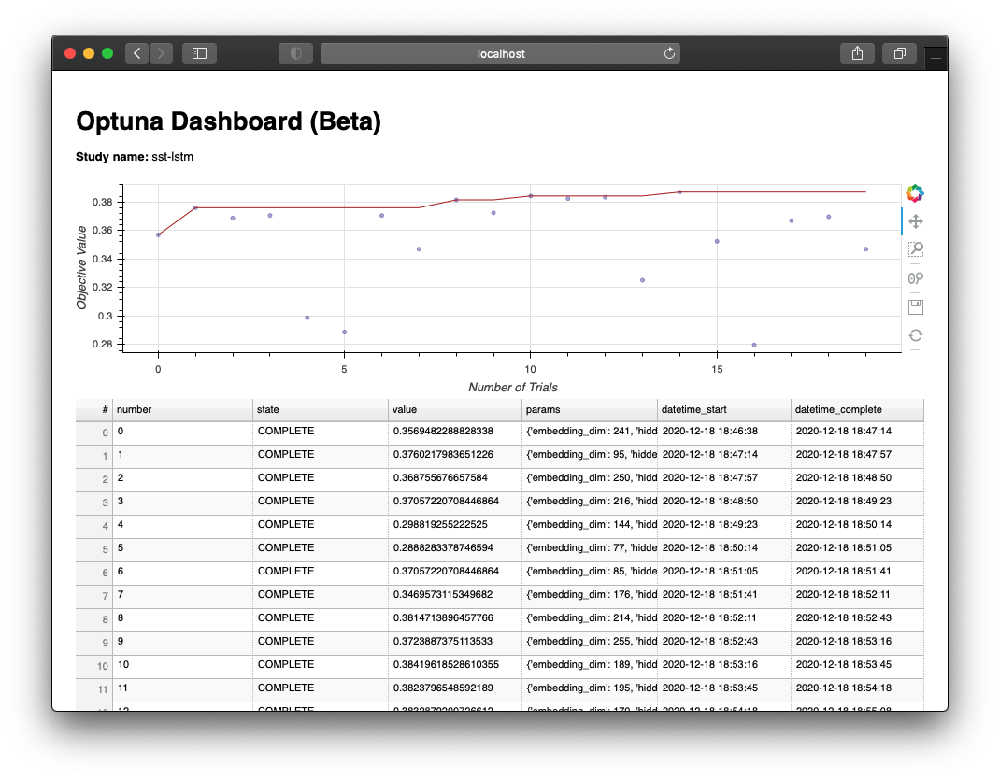

# Hyperparameter tuning w/ AllenNLP+Optuna

This directory contains an example for tuning hyperparameters with AllenNLP+Optuna.

You need to install AllenNLP (1.0.0+) and the Optuna plugin for AllenNLP as follows:

```
pip install allennlp
pip install allennlp_optuna
```

Also, as instructed by the [official readme](https://github.com/himkt/allennlp-optuna
), you need to register the plugin with AllenNLP:

```
echo 'allennlp_optuna' >> .allennlp_plugins
```

## Optimization

We are going to use the LSTM-based classifier for the Stanford Sentiment TreeBank dataset. The AllenNLP config file is [here](sst_classifier.jsonnet). Note that you need to reference the variables (`std.extVar`) in order for Optuna to have control over the parameters. Specifically, you need to define them as shown below at the beginning of the config file:

```
local embedding_dim = std.parseJson(std.extVar('embedding_dim'));
local hidden_dim = std.parseJson(std.extVar('hidden_dim'));
local lr = std.parseJson(std.extVar('lr'));
```

Then, you need to tell Optuna which parameters to optimize. You can do this by writing a JSON file ([hparams.json](hparams.json)). Basically you simply need to specify every hyperparameter you want Optuna to optimize, their type and range:

```
[
    {
        "type": "int",
        "attributes": {
            "name": "embedding_dim",
            "low": 64,
            "high": 256
        }
    },
    {
        "type": "int",
        "attributes": {
            "name": "hidden_dim",
            "low": 64,
            "high": 256
        }
    },
    {
        "type": "float",
        "attributes": {
            "name": "lr",
            "low": 1e-4,
            "high": 1e-1,
            "log": true
        }
    }
]
```

Then, invoke this command to start the optimization!

```
allennlp tune \
    examples/tuning/sst_classifier.jsonnet \
    examples/tuning/hparams.json \
    --include-package examples \
    --serialization-dir result \
    --study-name sst-lstm \
    --n-trials 20 \
    --metrics best_validation_accuracy \
    --direction maximize
```

Note that we are running 20 trials (`--n-trials`) with validation accuracy (`--metrics best_validation_accuracy`) as the metric to maximize (`--direction maximize`). If you do not specify the metric and the direction, by default Optuna tries to minimize the validation loss.

This will take a while but after all the trials are finished you will see a one-line summary of the optimization:

```
Trial 19 finished with value: 0.3469573115349682 and parameters: {'embedding_dim': 120, 'hidden_dim': 82, 'lr': 0.00011044322486693224}. Best is trial 14 with value: 0.3869209809264305.
```

## Visualization

Optuna supports a wide range of visualization of the optimization result, including [contour plots](https://optuna.readthedocs.io/en/stable/reference/visualization/generated/optuna.visualization.plot_contour.html#optuna.visualization.plot_contour) (this is my favorite!), but here we'll simply use its web-based dashboard to quickly inspect the optimization process.

All you need to invoke its dashboard from command line:

```
optuna dashboard --study-name sst-lstm --storage sqlite:///allennlp_optuna.db
```

Then you can access `http://localhost:5006/dashboard` to see the dashboard:


